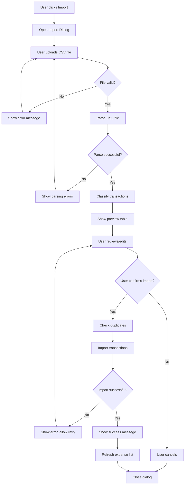

# Design Document: Automatic Transaction Import

## Overview

The Automatic Transaction Import feature extends the Personal Finance Spending Analyzer with the ability to bulk import transactions from bank statement CSV files. The feature follows a modular architecture that separates concerns into file handling, parsing, classification, and import layers, enabling future extensibility for bank API integrations.

The implementation uses:
- shadcn/ui components for a consistent, professional UI
- Client-side CSV parsing for security and performance
- Rule-based pattern matching combined with AI classification for automatic categorization
- Supabase for transaction storage with Row Level Security

## Architecture

```
┌─────────────────────────────────────────────────────────────────────────────┐
│                           Import Feature Architecture                        │
├─────────────────────────────────────────────────────────────────────────────┤
│                                                                              │
│  ┌──────────────────────────────────────────────────────────────────────┐   │
│  │                         UI Layer (shadcn/ui)                          │   │
│  │  ┌─────────────┐  ┌─────────────┐  ┌─────────────┐  ┌─────────────┐  │   │
│  │  │   Dialog    │  │    Table    │  │   Button    │  │   Alert     │  │   │
│  │  │  (Import)   │  │  (Preview)  │  │  (Actions)  │  │  (Status)   │  │   │
│  │  └─────────────┘  └─────────────┘  └─────────────┘  └─────────────┘  │   │
│  │  ┌─────────────┐                                                      │   │
│  │  │  Progress   │                                                      │   │
│  │  │ (Import)    │                                                      │   │
│  │  └─────────────┘                                                      │   │
│  └──────────────────────────────────────────────────────────────────────┘   │
│                                      │                                       │
│                                      ▼                                       │
│  ┌──────────────────────────────────────────────────────────────────────┐   │
│  │                       Import Controller Module                        │   │
│  │                      (js/transactionImport.js)                        │   │
│  │  - Orchestrates import workflow                                       │   │
│  │  - Manages state and UI updates                                       │   │
│  │  - Handles user interactions                                          │   │
│  └──────────────────────────────────────────────────────────────────────┘   │
│                    │                    │                    │               │
│                    ▼                    ▼                    ▼               │
│  ┌────────────────────┐  ┌────────────────────┐  ┌────────────────────┐     │
│  │   CSV Parser       │  │ Category Classifier │  │  Import Service    │     │
│  │ (js/csvParser.js)  │  │ (js/classifier.js)  │  │ (js/expenses.js)   │     │
│  │                    │  │                     │  │                    │     │
│  │ - File validation  │  │ - Rule-based match  │  │ - Duplicate check  │     │
│  │ - CSV parsing      │  │ - AI classification │  │ - Batch insert     │     │
│  │ - Data extraction  │  │ - Learning system   │  │ - Error handling   │     │
│  └────────────────────┘  └────────────────────┘  └────────────────────┘     │
│                                                              │               │
│                                                              ▼               │
│                                                  ┌────────────────────┐     │
│                                                  │     Supabase       │     │
│                                                  │   (expenses table) │     │
│                                                  └────────────────────┘     │
└─────────────────────────────────────────────────────────────────────────────┘
```

### Import Workflow Flow



## Components and Interfaces

### 1. CSV Parser Module (js/csvParser.js)

Handles file validation, CSV parsing, and data extraction.

```javascript
// Interface
const csvParserModule = {
  /**
   * Validate uploaded file
   * @param {File} file - The uploaded file
   * @returns {{valid: boolean, error: string|null}}
   */
  validateFile(file),

  /**
   * Parse CSV file content
   * @param {string} content - Raw CSV content
   * @param {Object} options - Parsing options (delimiter, hasHeader)
   * @returns {{data: ParsedRow[], headers: string[], errors: ParseError[]}}
   */
  parseCSV(content, options),

  /**
   * Detect column mappings from headers
   * @param {string[]} headers - CSV headers
   * @returns {{date: number, amount: number, description: number, detected: boolean}}
   */
  detectColumnMapping(headers),

  /**
   * Extract transactions from parsed data
   * @param {ParsedRow[]} data - Parsed CSV rows
   * @param {ColumnMapping} mapping - Column index mapping
   * @returns {{transactions: RawTransaction[], errors: ValidationError[]}}
   */
  extractTransactions(data, mapping),

  /**
   * Validate a single transaction row
   * @param {RawTransaction} transaction - Transaction to validate
   * @returns {{valid: boolean, errors: string[]}}
   */
  validateTransaction(transaction)
};
```

### 2. Category Classifier Module (js/classifier.js)

Handles automatic category assignment using rules and AI.

```javascript
// Interface
const classifierModule = {
  /**
   * Classify a single transaction
   * @param {RawTransaction} transaction - Transaction to classify
   * @returns {{category: string, confidence: number, method: 'rule'|'ai'}}
   */
  classifyTransaction(transaction),

  /**
   * Classify multiple transactions in batch
   * @param {RawTransaction[]} transactions - Transactions to classify
   * @returns {ClassifiedTransaction[]}
   */
  classifyBatch(transactions),

  /**
   * Add a user correction to improve future classifications
   * @param {string} description - Transaction description
   * @param {string} category - Correct category
   */
  learnFromCorrection(description, category),

  /**
   * Get classification rules
   * @returns {ClassificationRule[]}
   */
  getRules(),

  /**
   * Match description against rules
   * @param {string} description - Transaction description
   * @returns {{matched: boolean, category: string|null, rule: string|null}}
   */
  matchRules(description)
};
```

### 3. Transaction Import Module (js/transactionImport.js)

Orchestrates the import workflow and manages UI state.

```javascript
// Interface
const transactionImportModule = {
  /**
   * Initialize the import dialog
   */
  initImportDialog(),

  /**
   * Open the import dialog
   */
  openImportDialog(),

  /**
   * Close the import dialog and cleanup
   */
  closeImportDialog(),

  /**
   * Handle file selection
   * @param {File} file - Selected file
   */
  handleFileSelect(file),

  /**
   * Process uploaded file
   * @param {File} file - CSV file to process
   * @returns {Promise<ProcessResult>}
   */
  processFile(file),

  /**
   * Update category for a transaction
   * @param {number} index - Transaction index
   * @param {string} category - New category
   */
  updateTransactionCategory(index, category),

  /**
   * Toggle transaction selection
   * @param {number} index - Transaction index
   */
  toggleTransactionSelection(index),

  /**
   * Select/deselect all transactions
   * @param {boolean} selected - Selection state
   */
  selectAllTransactions(selected),

  /**
   * Import selected transactions
   * @returns {Promise<ImportResult>}
   */
  importTransactions(),

  /**
   * Get current import state
   * @returns {ImportState}
   */
  getState()
};
```

### 4. Extended Expenses Module (js/expenses.js)

Extended with batch import and duplicate detection.

```javascript
// Additional interface methods
const expensesModuleExtensions = {
  /**
   * Check for duplicate transactions
   * @param {Transaction[]} transactions - Transactions to check
   * @returns {Promise<{duplicates: Transaction[], unique: Transaction[]}>}
   */
  checkDuplicates(transactions),

  /**
   * Import multiple transactions in batch
   * @param {Transaction[]} transactions - Transactions to import
   * @returns {Promise<{imported: number, failed: Transaction[], errors: string[]}>}
   */
  batchImportTransactions(transactions)
};
```

## Data Models

### Type Definitions

```javascript
/**
 * Raw transaction extracted from CSV
 */
interface RawTransaction {
  date: string;           // Original date string from CSV
  amount: string;         // Original amount string from CSV
  description: string;    // Transaction description
  rowNumber: number;      // Source row number for error reporting
}

/**
 * Validated and parsed transaction
 */
interface ParsedTransaction {
  date: Date;             // Parsed date object
  amount: number;         // Parsed numeric amount
  description: string;    // Cleaned description
  rowNumber: number;      // Source row number
  isValid: boolean;       // Validation status
  errors: string[];       // Validation errors if any
}

/**
 * Transaction with category classification
 */
interface ClassifiedTransaction extends ParsedTransaction {
  category: string;       // Assigned category
  confidence: number;     // Classification confidence (0-1)
  method: 'rule' | 'ai';  // Classification method used
  selected: boolean;      // User selection state for import
}

/**
 * Column mapping for CSV parsing
 */
interface ColumnMapping {
  date: number;           // Column index for date
  amount: number;         // Column index for amount
  description: number;    // Column index for description
  detected: boolean;      // Whether mapping was auto-detected
}

/**
 * CSV parsing options
 */
interface ParseOptions {
  delimiter: ',' | ';' | '\t';  // Field delimiter
  hasHeader: boolean;           // First row is header
  encoding: string;             // File encoding
}

/**
 * Parse error details
 */
interface ParseError {
  row: number;            // Row number where error occurred
  column: number;         // Column number if applicable
  message: string;        // Error description
  value: string;          // Problematic value
}

/**
 * Classification rule
 */
interface ClassificationRule {
  id: string;             // Rule identifier
  pattern: RegExp;        // Pattern to match
  category: string;       // Category to assign
  priority: number;       // Rule priority (higher = checked first)
  keywords: string[];     // Keywords for matching
}

/**
 * Import state
 */
interface ImportState {
  step: 'upload' | 'preview' | 'importing' | 'complete' | 'error';
  file: File | null;
  transactions: ClassifiedTransaction[];
  summary: ImportSummary;
  progress: number;       // 0-100
  error: string | null;
}

/**
 * Import summary statistics
 */
interface ImportSummary {
  total: number;          // Total transactions parsed
  valid: number;          // Valid transactions
  invalid: number;        // Invalid transactions
  selected: number;       // Selected for import
  duplicates: number;     // Duplicate transactions found
  totalAmount: number;    // Sum of selected transaction amounts
}

/**
 * Import result
 */
interface ImportResult {
  success: boolean;
  imported: number;
  failed: number;
  errors: string[];
}
```

### Predefined Classification Rules

```javascript
const CLASSIFICATION_RULES = [
  // Food & Dining
  { pattern: /swiggy|zomato|uber\s*eats|dominos|pizza|mcdonald|kfc|starbucks|cafe|restaurant|food/i, category: 'Food & Dining', priority: 10 },
  
  // Transportation
  { pattern: /uber|ola|rapido|metro|petrol|fuel|parking|toll|irctc|railway|flight|airline/i, category: 'Transportation', priority: 10 },
  
  // Shopping
  { pattern: /amazon|flipkart|myntra|ajio|nykaa|mall|store|shop|retail/i, category: 'Shopping', priority: 10 },
  
  // Utilities
  { pattern: /electricity|water|gas|internet|broadband|wifi|mobile|recharge|bill\s*pay/i, category: 'Utilities', priority: 10 },
  
  // Entertainment
  { pattern: /netflix|prime|hotstar|spotify|youtube|movie|cinema|pvr|inox|game/i, category: 'Entertainment', priority: 10 },
  
  // Healthcare
  { pattern: /hospital|clinic|pharmacy|medical|doctor|health|apollo|medplus|1mg/i, category: 'Healthcare', priority: 10 },
  
  // Subscriptions
  { pattern: /subscription|membership|premium|annual|monthly\s*fee/i, category: 'Subscriptions', priority: 8 },
  
  // Education
  { pattern: /school|college|university|course|udemy|coursera|book|education|tuition/i, category: 'Education', priority: 10 },
  
  // Housing
  { pattern: /rent|maintenance|society|housing|apartment|flat/i, category: 'Housing', priority: 10 },
  
  // Personal Care
  { pattern: /salon|spa|gym|fitness|grooming|beauty/i, category: 'Personal Care', priority: 10 },
  
  // Travel
  { pattern: /hotel|booking|makemytrip|goibibo|airbnb|travel|trip|vacation/i, category: 'Travel', priority: 10 }
];
```

### Common CSV Header Mappings

```javascript
const HEADER_MAPPINGS = {
  date: ['date', 'transaction date', 'txn date', 'value date', 'posting date', 'trans date'],
  amount: ['amount', 'debit', 'credit', 'withdrawal', 'deposit', 'transaction amount', 'txn amount'],
  description: ['description', 'narration', 'particulars', 'details', 'remarks', 'transaction details', 'memo']
};
```


## Correctness Properties

*A property is a characteristic or behavior that should hold true across all valid executions of a system—essentially, a formal statement about what the system should do. Properties serve as the bridge between human-readable specifications and machine-verifiable correctness guarantees.*

### Property 1: File Validation

*For any* uploaded file, the validation function SHALL return valid=true only if the file has a .csv extension AND the file size is less than or equal to 5MB. All other files SHALL return valid=false with an appropriate error message.

**Validates: Requirements 1.2, 1.5**

### Property 2: CSV Parsing Round-Trip

*For any* valid CSV content with consistent delimiters (comma, semicolon, or tab), parsing the content and then reconstructing it SHALL produce equivalent data rows. The parser SHALL correctly handle files with or without headers, and all parsed values SHALL have leading and trailing whitespace trimmed.

**Validates: Requirements 2.1, 2.2, 2.8, 2.9**

### Property 3: Header Column Detection

*For any* CSV file with a header row containing common column names (from the predefined mapping list), the detectColumnMapping function SHALL correctly identify the indices for date, amount, and description columns. The function SHALL be case-insensitive and handle variations in column naming.

**Validates: Requirements 2.3**

### Property 4: Transaction Row Validation

*For any* parsed transaction row, the validation function SHALL return valid=false if: (a) the date cannot be parsed into a valid date, (b) the amount is not a valid positive number, or (c) any required field (date, amount, description) is empty. Each validation failure SHALL include a specific error message identifying the issue.

**Validates: Requirements 2.4, 2.5, 2.6, 2.7**

### Property 5: Preview Summary Calculation

*For any* set of parsed transactions, the summary calculation SHALL produce: (a) total count equal to the array length, (b) valid count equal to transactions where isValid=true, (c) invalid count equal to total minus valid, (d) selected count equal to transactions where selected=true, and (e) totalAmount equal to the sum of amounts for selected valid transactions.

**Validates: Requirements 3.4**

### Property 6: Transaction Sorting

*For any* array of transactions displayed in the preview, the transactions SHALL be sorted by date in descending order such that for any two consecutive transactions t[i] and t[i+1], the date of t[i] is greater than or equal to the date of t[i+1].

**Validates: Requirements 3.7**

### Property 7: Select All Toggle

*For any* set of transactions in the preview, calling selectAllTransactions(true) SHALL set selected=true for all valid transactions, and calling selectAllTransactions(false) SHALL set selected=false for all transactions. Invalid transactions SHALL never be selectable.

**Validates: Requirements 3.6**

### Property 8: Category Classification Correctness

*For any* transaction description, the classifyTransaction function SHALL return a category that is one of the predefined expense categories. If the description matches a classification rule pattern, the matched rule's category SHALL be returned with method='rule'. If no rule matches, the AI classifier SHALL be used with method='ai'. If classification confidence is below threshold, the category SHALL be 'Other'.

**Validates: Requirements 4.1, 4.2, 4.3, 4.4, 4.5**

### Property 9: Classification Learning

*For any* user category correction, calling learnFromCorrection(description, category) SHALL store the correction such that future classifications of similar descriptions prioritize the corrected category.

**Validates: Requirements 4.7**

### Property 10: Import Selection Correctness

*For any* import operation, only transactions where selected=true AND isValid=true SHALL be imported. Transactions where selected=false OR isValid=false SHALL not be imported.

**Validates: Requirements 5.1**

### Property 11: Duplicate Detection

*For any* transaction being imported, if an expense record already exists with the same date, amount (within 0.01 tolerance), and description (case-insensitive), the transaction SHALL be flagged as a duplicate and excluded from import.

**Validates: Requirements 5.8**

### Property 12: Import Creates Correct Expense Records

*For any* successfully imported transaction, the created expense record SHALL have: expense_name equal to the transaction description, category equal to the classified category, amount equal to the transaction amount, date equal to the transaction date, and user_id equal to the authenticated user's ID.

**Validates: Requirements 5.4, 8.4**

### Property 13: State Preservation on Error

*For any* error that occurs during the import operation, the import state (including user selections, category edits, and transaction data) SHALL be preserved, allowing the user to retry without re-uploading the file.

**Validates: Requirements 6.4**

### Property 14: Cleanup on Dialog Close

*For any* dialog close action (whether by cancel, successful import, or explicit close), all temporary data including the file reference, parsed transactions, and import state SHALL be cleared from memory.

**Validates: Requirements 6.5, 8.5**

### Property 15: Parsing Error Reporting

*For any* CSV parsing error, the error report SHALL include the specific row number where the error occurred and a descriptive message explaining the parsing failure.

**Validates: Requirements 6.2**

## Error Handling

### File Upload Errors

| Error Scenario | User Message | Recovery Action |
|----------------|--------------|-----------------|
| Invalid file extension | "Please select a CSV file (.csv)" | Clear file input, allow reselection |
| File too large | "File size exceeds 5MB limit. Please select a smaller file." | Clear file input, allow reselection |
| File read error | "Unable to read file. Please try again." | Clear file input, allow reselection |
| Empty file | "The selected file is empty. Please select a valid CSV file." | Clear file input, allow reselection |

### CSV Parsing Errors

| Error Scenario | User Message | Recovery Action |
|----------------|--------------|-----------------|
| No data rows | "No transaction data found in the file." | Allow file reselection |
| Missing required columns | "Missing required columns: [column names]. Please ensure your CSV has date, amount, and description columns." | Allow file reselection |
| Malformed CSV | "Unable to parse CSV at row [N]: [specific error]" | Show error details, allow file reselection |
| Encoding error | "Unable to read file encoding. Please save the file as UTF-8." | Allow file reselection |

### Transaction Validation Errors

| Error Scenario | User Message | Recovery Action |
|----------------|--------------|-----------------|
| Invalid date | "Row [N]: Invalid date format '[value]'" | Highlight row, allow skip or manual fix |
| Invalid amount | "Row [N]: Invalid amount '[value]'" | Highlight row, allow skip or manual fix |
| Empty required field | "Row [N]: Missing [field name]" | Highlight row, allow skip or manual fix |

### Import Errors

| Error Scenario | User Message | Recovery Action |
|----------------|--------------|-----------------|
| Network error | "Network error during import. Please check your connection and try again." | Preserve state, show retry button |
| Database error | "Unable to save transactions. Please try again." | Preserve state, show retry button |
| Partial failure | "[N] of [M] transactions imported. [X] failed. Would you like to retry failed transactions?" | Show failed transactions, allow retry |
| Duplicate detected | "[N] duplicate transactions found and skipped." | Show duplicates, continue with unique |

## Testing Strategy

### Dual Testing Approach

This feature requires both unit tests and property-based tests for comprehensive coverage:

- **Unit tests**: Verify specific examples, edge cases, and error conditions
- **Property-based tests**: Verify universal properties across randomly generated inputs

### Property-Based Testing Configuration

**Library**: fast-check (JavaScript property-based testing library)

**Configuration**:
- Minimum 100 iterations per property test
- Each test tagged with feature and property reference
- Tag format: `Feature: automatic-transaction-import, Property N: [property description]`

### Test Categories

#### 1. File Validation Tests (Property 1)

Unit tests for specific scenarios:
- Valid .csv file under 5MB
- Invalid extensions (.txt, .xlsx, .pdf)
- File exactly at 5MB limit
- File slightly over 5MB limit

Property tests:
- Generate random file names and sizes, verify validation correctness

#### 2. CSV Parsing Tests (Properties 2, 3, 15)

Unit tests for specific scenarios:
- CSV with comma delimiter
- CSV with semicolon delimiter
- CSV with tab delimiter
- CSV with headers
- CSV without headers
- CSV with quoted fields containing delimiters
- Malformed CSV with unclosed quotes

Property tests:
- Generate random CSV content, verify parsing round-trip
- Generate random header variations, verify column detection

#### 3. Transaction Validation Tests (Property 4)

Unit tests for specific scenarios:
- Valid transaction with all fields
- Transaction with invalid date formats
- Transaction with negative amount
- Transaction with non-numeric amount
- Transaction with empty description

Property tests:
- Generate random transaction data, verify validation rules

#### 4. Summary Calculation Tests (Property 5)

Unit tests for specific scenarios:
- Empty transaction list
- All valid transactions
- All invalid transactions
- Mixed valid/invalid transactions

Property tests:
- Generate random transaction sets, verify summary calculations

#### 5. Sorting Tests (Property 6)

Unit tests for specific scenarios:
- Already sorted transactions
- Reverse sorted transactions
- Transactions with same date

Property tests:
- Generate random transaction dates, verify sort order

#### 6. Selection Tests (Property 7)

Unit tests for specific scenarios:
- Select all with all valid transactions
- Select all with mixed valid/invalid
- Deselect all

Property tests:
- Generate random transaction sets, verify selection behavior

#### 7. Classification Tests (Properties 8, 9)

Unit tests for specific scenarios:
- Known merchant patterns (Swiggy, Amazon, etc.)
- Unknown descriptions
- Edge cases (empty description, special characters)

Property tests:
- Generate random descriptions, verify category is always valid
- Generate corrections, verify learning is applied

#### 8. Import Tests (Properties 10, 11, 12, 13, 14)

Unit tests for specific scenarios:
- Import selected valid transactions only
- Skip unselected transactions
- Skip invalid transactions
- Detect exact duplicates
- Detect near-duplicates (amount tolerance)

Property tests:
- Generate random transaction sets with selections, verify import correctness
- Generate transactions with potential duplicates, verify detection

### Test File Structure

```
tests/
├── unit/
│   ├── csvParser.test.js
│   ├── classifier.test.js
│   ├── transactionImport.test.js
│   └── importValidation.test.js
├── property/
│   ├── csvParser.property.test.js
│   ├── classifier.property.test.js
│   ├── transactionValidation.property.test.js
│   ├── importSelection.property.test.js
│   └── duplicateDetection.property.test.js
└── integration/
    └── transactionImport.integration.test.js
```

### Mocking Strategy

- **File API**: Mock FileReader for unit tests
- **Supabase client**: Mock for unit tests, real client for integration tests
- **AI classifier**: Mock for deterministic unit tests

### Coverage Goals

- Unit test coverage: 80%+ for all modules
- Property test coverage: All 15 correctness properties
- Integration test coverage: Complete import workflow
