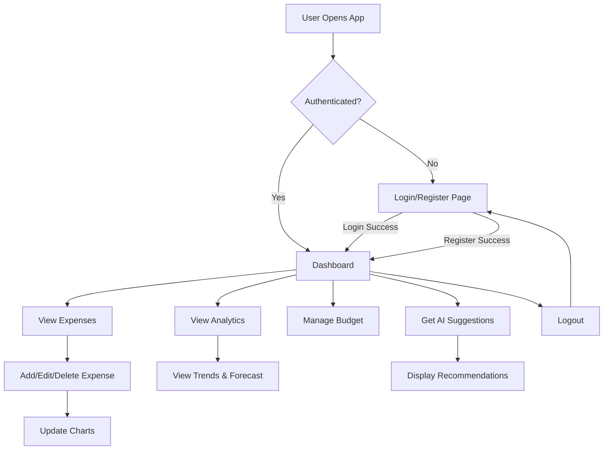

# Design Document: Personal Finance Spending Analyzer

## Overview

The Personal Finance Spending Analyzer is a single-page web application built with HTML, CSS, and vanilla JavaScript, integrated with Supabase for backend services. The application follows a mobile-first design approach with a modular architecture separating concerns into authentication, data management, analytics, AI suggestions, and visualization layers.

The application uses Supabase for:
- User authentication (email/password)
- PostgreSQL database with Row Level Security
- Real-time data synchronization

## Architecture

```
┌─────────────────────────────────────────────────────────────────┐
│                        Browser (Client)                          │
├─────────────────────────────────────────────────────────────────┤
│  ┌─────────────┐  ┌─────────────┐  ┌─────────────────────────┐  │
│  │   index.html │  │  styles.css │  │      JavaScript         │  │
│  │   (Views)    │  │  (Styling)  │  │      Modules            │  │
│  └─────────────┘  └─────────────┘  └─────────────────────────┘  │
│                                              │                   │
│  ┌───────────────────────────────────────────┴───────────────┐  │
│  │                    Module Structure                        │  │
│  │  ┌──────────┐ ┌──────────┐ ┌──────────┐ ┌──────────────┐  │  │
│  │  │   auth   │ │ expenses │ │  budget  │ │  analytics   │  │  │
│  │  │  .js     │ │   .js    │ │   .js    │ │     .js      │  │  │
│  │  └──────────┘ └──────────┘ └──────────┘ └──────────────┘  │  │
│  │  ┌──────────┐ ┌──────────┐ ┌──────────┐ ┌──────────────┐  │  │
│  │  │  charts  │ │    ai    │ │   ui     │ │   supabase   │  │  │
│  │  │   .js    │ │   .js    │ │   .js    │ │   Config.js  │  │  │
│  │  └──────────┘ └──────────┘ └──────────┘ └──────────────┘  │  │
│  └───────────────────────────────────────────────────────────┘  │
└─────────────────────────────────────────────────────────────────┘
                              │
                              │ HTTPS
                              ▼
┌─────────────────────────────────────────────────────────────────┐
│                         Supabase                                 │
├─────────────────────────────────────────────────────────────────┤
│  ┌─────────────────┐  ┌─────────────────────────────────────┐   │
│  │  Authentication │  │         PostgreSQL Database          │   │
│  │    Service      │  │  ┌───────┐ ┌─────────┐ ┌─────────┐  │   │
│  │                 │  │  │ Users │ │Expenses │ │ Budgets │  │   │
│  └─────────────────┘  │  └───────┘ └─────────┘ └─────────┘  │   │
│                       │         Row Level Security           │   │
│                       └─────────────────────────────────────┘   │
└─────────────────────────────────────────────────────────────────┘
```

### Application Flow



## Components and Interfaces

### 1. Supabase Configuration Module (supabaseConfig.js)

Initializes and exports the Supabase client instance.

```javascript
// Interface
const supabaseConfig = {
  client: SupabaseClient,  // Initialized Supabase client
  SUPABASE_URL: string,    // Project URL
  SUPABASE_ANON_KEY: string // Anonymous key
};
```

### 2. Authentication Module (auth.js)

Handles user registration, login, logout, and session management.

```javascript
// Interface
const authModule = {
  // Register new user with profile data
  register(name, email, password, phone): Promise<{user, error}>,
  
  // Login existing user
  login(email, password): Promise<{session, error}>,
  
  // Logout current user
  logout(): Promise<{error}>,
  
  // Get current session
  getSession(): Promise<{session, error}>,
  
  // Get current user
  getCurrentUser(): Promise<User | null>,
  
  // Listen to auth state changes
  onAuthStateChange(callback): Subscription
};
```

### 3. Expenses Module (expenses.js)

Manages CRUD operations for expense records.

```javascript
// Interface
const expensesModule = {
  // Create new expense
  createExpense(expense: ExpenseInput): Promise<{data, error}>,
  
  // Get all expenses for current user
  getExpenses(): Promise<{data: Expense[], error}>,
  
  // Get expenses for specific month/year
  getExpensesByMonth(year, month): Promise<{data: Expense[], error}>,
  
  // Update existing expense
  updateExpense(id, updates): Promise<{data, error}>,
  
  // Delete expense
  deleteExpense(id): Promise<{error}>,
  
  // Get expenses grouped by category
  getExpensesByCategory(): Promise<{data: CategorySummary[], error}>
};
```

### 4. Budget Module (budget.js)

Manages user budget configuration.

```javascript
// Interface
const budgetModule = {
  // Get current budget settings
  getBudget(): Promise<{data: Budget, error}>,
  
  // Create or update budget
  saveBudget(monthlyIncome, savingsGoal): Promise<{data, error}>,
  
  // Calculate available spending budget
  getAvailableBudget(): Promise<number>
};
```

### 5. Analytics Module (analytics.js)

Performs spending calculations and trend analysis.

```javascript
// Interface
const analyticsModule = {
  // Get current month total
  getCurrentMonthTotal(): Promise<number>,
  
  // Get category breakdown with percentages
  getCategoryBreakdown(): Promise<CategoryBreakdown[]>,
  
  // Check if overspending
  checkOverspending(): Promise<{isOverspending: boolean, amount: number}>,
  
  // Get monthly totals for past N months
  getMonthlyTotals(months: number): Promise<MonthlyTotal[]>,
  
  // Get highest spending categories
  getTopCategories(limit: number): Promise<CategorySummary[]>,
  
  // Calculate month-over-month change
  getMonthOverMonthChange(): Promise<{percentage: number, direction: string}>
};
```

### 6. Forecast Module (forecast.js)

Predicts future spending using statistical methods.

```javascript
// Interface
const forecastModule = {
  // Calculate 3-month moving average
  calculateMovingAverage(data: number[], period: number): number,
  
  // Calculate trend direction and magnitude
  calculateTrend(data: number[]): {slope: number, direction: string},
  
  // Predict next month spending
  predictNextMonth(): Promise<{
    prediction: number,
    confidence: string,
    basedOnMonths: number
  }>
};
```

### 7. AI Budget Engine Module (ai.js)

Generates rule-based budget recommendations.

```javascript
// Interface
const aiModule = {
  // Analyze user financial data
  analyzeFinances(): Promise<FinancialAnalysis>,
  
  // Generate category budget limits
  generateCategoryLimits(analysis: FinancialAnalysis): CategoryLimit[],
  
  // Calculate ideal savings percentage
  calculateIdealSavings(analysis: FinancialAnalysis): number,
  
  // Generate expense reduction tips
  generateTips(analysis: FinancialAnalysis): Tip[],
  
  // Generate saving plans
  generateSavingPlans(analysis: FinancialAnalysis): SavingPlan[],
  
  // Get complete AI budget plan
  getBudgetPlan(): Promise<BudgetPlan>
};
```

### 8. Charts Module (charts.js)

Renders canvas-based visualizations.

```javascript
// Interface
const chartsModule = {
  // Render pie chart for category distribution
  renderPieChart(canvas: HTMLCanvasElement, data: CategoryData[]): void,
  
  // Render line chart for trends
  renderLineChart(canvas: HTMLCanvasElement, data: MonthlyData[]): void,
  
  // Render forecast chart with prediction
  renderForecastChart(canvas: HTMLCanvasElement, historical: number[], forecast: number): void,
  
  // Clear and resize canvas
  prepareCanvas(canvas: HTMLCanvasElement): CanvasRenderingContext2D,
  
  // Draw legend
  drawLegend(ctx: CanvasRenderingContext2D, items: LegendItem[]): void
};
```

### 9. UI Module (ui.js)

Handles DOM manipulation, navigation, and user feedback.

```javascript
// Interface
const uiModule = {
  // Show/hide views
  showView(viewId: string): void,
  
  // Display success message
  showSuccess(message: string): void,
  
  // Display error message
  showError(message: string): void,
  
  // Show loading indicator
  showLoading(): void,
  
  // Hide loading indicator
  hideLoading(): void,
  
  // Render expense list
  renderExpenseList(expenses: Expense[]): void,
  
  // Render dashboard analytics
  renderDashboard(data: DashboardData): void,
  
  // Render AI suggestions
  renderAISuggestions(plan: BudgetPlan): void,
  
  // Initialize event listeners
  initEventListeners(): void
};
```

## Data Models

### Database Schema

```sql
-- Users Table (extends Supabase auth.users)
CREATE TABLE public.users (
  id UUID PRIMARY KEY REFERENCES auth.users(id) ON DELETE CASCADE,
  name TEXT NOT NULL,
  email TEXT NOT NULL UNIQUE,
  phone TEXT,
  created_at TIMESTAMP WITH TIME ZONE DEFAULT NOW()
);

-- Expenses Table
CREATE TABLE public.expenses (
  id UUID PRIMARY KEY DEFAULT gen_random_uuid(),
  user_id UUID NOT NULL REFERENCES public.users(id) ON DELETE CASCADE,
  expense_name TEXT NOT NULL,
  category TEXT NOT NULL,
  amount DECIMAL(10,2) NOT NULL CHECK (amount > 0),
  date DATE NOT NULL,
  created_at TIMESTAMP WITH TIME ZONE DEFAULT NOW()
);

-- Budgets Table
CREATE TABLE public.budgets (
  id UUID PRIMARY KEY DEFAULT gen_random_uuid(),
  user_id UUID NOT NULL REFERENCES public.users(id) ON DELETE CASCADE,
  monthly_income DECIMAL(10,2) NOT NULL CHECK (monthly_income >= 0),
  savings_goal DECIMAL(10,2) NOT NULL CHECK (savings_goal >= 0),
  created_at TIMESTAMP WITH TIME ZONE DEFAULT NOW(),
  UNIQUE(user_id)
);

-- Row Level Security Policies
ALTER TABLE public.users ENABLE ROW LEVEL SECURITY;
ALTER TABLE public.expenses ENABLE ROW LEVEL SECURITY;
ALTER TABLE public.budgets ENABLE ROW LEVEL SECURITY;

-- Users can only access their own data
CREATE POLICY "Users can view own profile" ON public.users
  FOR SELECT USING (auth.uid() = id);

CREATE POLICY "Users can update own profile" ON public.users
  FOR UPDATE USING (auth.uid() = id);

CREATE POLICY "Users can insert own profile" ON public.users
  FOR INSERT WITH CHECK (auth.uid() = id);

-- Expenses policies
CREATE POLICY "Users can view own expenses" ON public.expenses
  FOR SELECT USING (auth.uid() = user_id);

CREATE POLICY "Users can insert own expenses" ON public.expenses
  FOR INSERT WITH CHECK (auth.uid() = user_id);

CREATE POLICY "Users can update own expenses" ON public.expenses
  FOR UPDATE USING (auth.uid() = user_id);

CREATE POLICY "Users can delete own expenses" ON public.expenses
  FOR DELETE USING (auth.uid() = user_id);

-- Budgets policies
CREATE POLICY "Users can view own budget" ON public.budgets
  FOR SELECT USING (auth.uid() = user_id);

CREATE POLICY "Users can insert own budget" ON public.budgets
  FOR INSERT WITH CHECK (auth.uid() = user_id);

CREATE POLICY "Users can update own budget" ON public.budgets
  FOR UPDATE USING (auth.uid() = user_id);
```

### TypeScript-like Type Definitions (for documentation)

```javascript
// User type
interface User {
  id: string;           // UUID
  name: string;
  email: string;
  phone: string | null;
  created_at: string;   // ISO timestamp
}

// Expense type
interface Expense {
  id: string;           // UUID
  user_id: string;      // UUID
  expense_name: string;
  category: string;
  amount: number;       // Positive decimal
  date: string;         // YYYY-MM-DD
  created_at: string;   // ISO timestamp
}

// ExpenseInput type (for creating expenses)
interface ExpenseInput {
  expense_name: string;
  category: string;
  amount: number;
  date: string;
}

// Budget type
interface Budget {
  id: string;           // UUID
  user_id: string;      // UUID
  monthly_income: number;
  savings_goal: number;
  created_at: string;   // ISO timestamp
}

// Category breakdown for analytics
interface CategoryBreakdown {
  category: string;
  total: number;
  percentage: number;
  count: number;
}

// Monthly total for trends
interface MonthlyTotal {
  year: number;
  month: number;
  total: number;
  label: string;        // "Jan 2024"
}

// AI Budget Plan
interface BudgetPlan {
  categoryLimits: CategoryLimit[];
  idealSavingsPercentage: number;
  tips: Tip[];
  shortTermPlan: SavingPlan;
  longTermPlan: SavingPlan;
  summary: string;
}

// Category limit recommendation
interface CategoryLimit {
  category: string;
  currentSpending: number;
  recommendedLimit: number;
  priority: 'high' | 'medium' | 'low';
}

// Expense reduction tip
interface Tip {
  category: string;
  message: string;
  potentialSavings: number;
  priority: 'high' | 'medium' | 'low';
}

// Saving plan
interface SavingPlan {
  type: 'short-term' | 'long-term';
  targetAmount: number;
  monthlyContribution: number;
  timeframeMonths: number;
  milestones: string[];
}
```

### Predefined Categories

```javascript
const EXPENSE_CATEGORIES = [
  'Food & Dining',
  'Transportation',
  'Housing',
  'Utilities',
  'Healthcare',
  'Entertainment',
  'Shopping',
  'Education',
  'Personal Care',
  'Travel',
  'Subscriptions',
  'Other'
];
```


## Correctness Properties

*A property is a characteristic or behavior that should hold true across all valid executions of a system—essentially, a formal statement about what the system should do. Properties serve as the bridge between human-readable specifications and machine-verifiable correctness guarantees.*

### Property 1: Email Validation

*For any* string input, the email validation function SHALL return true only if the string matches a valid email format (contains @ symbol, valid domain structure), and false for all other strings.

**Validates: Requirements 1.3**

### Property 2: Password Validation

*For any* string input, the password validation function SHALL return true only if the string length is 8 or more characters, and false for all strings with fewer than 8 characters.

**Validates: Requirements 1.4**

### Property 3: Phone Validation

*For any* string input, the phone validation function SHALL return true only if the string matches a valid phone number format, and false for all invalid formats.

**Validates: Requirements 1.5**

### Property 4: Expense Input Validation

*For any* expense input object, the validation function SHALL return false if any required field (expense_name, category, amount, date) is missing or empty, OR if the amount is less than or equal to zero.

**Validates: Requirements 3.5, 3.6**

### Property 5: Budget Input Validation

*For any* budget input with monthly_income or savings_goal values, the validation function SHALL return false if either value is negative.

**Validates: Requirements 4.4**

### Property 6: Expense CRUD Round-Trip

*For any* valid expense object, creating the expense and then retrieving it SHALL return an expense with identical expense_name, category, amount, and date values. Updating an expense and then retrieving it SHALL reflect the updated values. Deleting an expense and then attempting to retrieve it SHALL return no result.

**Validates: Requirements 3.1, 3.2, 3.3**

### Property 7: Expense List Sorting

*For any* list of expenses returned by getExpenses(), the list SHALL be sorted by date in descending order (most recent first), such that for any two consecutive expenses, the first expense's date is greater than or equal to the second expense's date.

**Validates: Requirements 3.4**

### Property 8: Budget CRUD Round-Trip

*For any* valid budget configuration, saving the budget and then retrieving it SHALL return a budget with identical monthly_income and savings_goal values.

**Validates: Requirements 4.1, 4.2**

### Property 9: Monthly Total Calculation

*For any* set of expenses in a given month, the getCurrentMonthTotal() function SHALL return a value equal to the sum of all expense amounts for that month.

**Validates: Requirements 5.1**

### Property 10: Category Breakdown Consistency

*For any* set of expenses, the getCategoryBreakdown() function SHALL return categories where:
1. The sum of all category totals equals the overall total expenses
2. Each category's percentage equals (category_total / overall_total) * 100
3. All percentages sum to 100% (within floating-point tolerance)

**Validates: Requirements 5.2, 5.3**

### Property 11: Overspending Detection

*For any* budget with monthly_income and savings_goal, and any total_expenses amount, the checkOverspending() function SHALL return isOverspending=true if and only if total_expenses > (monthly_income - savings_goal).

**Validates: Requirements 5.4**

### Property 12: Monthly Aggregation

*For any* set of expenses spanning multiple months, the getMonthlyTotals(n) function SHALL return exactly n monthly totals (or fewer if insufficient data), where each monthly total equals the sum of expenses for that specific month.

**Validates: Requirements 6.1**

### Property 13: Category Ranking

*For any* set of expenses with multiple categories, the getTopCategories(limit) function SHALL return categories sorted by total amount in descending order, with the first category having the highest total.

**Validates: Requirements 6.2**

### Property 14: Month-Over-Month Change Calculation

*For any* two consecutive months with totals M1 and M2, the getMonthOverMonthChange() function SHALL return a percentage equal to ((M2 - M1) / M1) * 100, with direction "increase" if positive, "decrease" if negative, or "unchanged" if zero.

**Validates: Requirements 6.4**

### Property 15: Moving Average Calculation

*For any* array of n numeric values where n >= period, the calculateMovingAverage(data, period) function SHALL return the arithmetic mean of the last 'period' values in the array.

**Validates: Requirements 7.1**

### Property 16: Trend Estimation

*For any* array of at least 2 numeric values, the calculateTrend(data) function SHALL return:
1. A positive slope if the values are generally increasing
2. A negative slope if the values are generally decreasing
3. A slope near zero if values are stable
4. Direction "up", "down", or "stable" matching the slope sign

**Validates: Requirements 7.2**

### Property 17: AI Budget Plan Validity

*For any* financial analysis with valid income and expense data, the getBudgetPlan() function SHALL return a plan where:
1. The sum of all recommended category limits does not exceed monthly_income
2. The idealSavingsPercentage is between 0 and 100
3. Each tip targets a category that exists in the user's spending
4. Short-term and long-term plans have positive targetAmount and monthlyContribution values

**Validates: Requirements 8.2, 8.3, 8.4, 8.5**

### Property 18: Data Isolation

*For any* authenticated user, all database queries for expenses and budgets SHALL only return records where user_id matches the authenticated user's ID.

**Validates: Requirements 2.6**

### Property 19: Pie Chart Data Accuracy

*For any* category breakdown data rendered to a pie chart, the sum of all slice angles SHALL equal 360 degrees (or 2π radians), and each slice's angle SHALL be proportional to its category's percentage of the total.

**Validates: Requirements 9.1**

### Property 20: Line Chart Data Accuracy

*For any* monthly totals data rendered to a line chart, each data point's y-coordinate SHALL be proportional to its value relative to the maximum value in the dataset.

**Validates: Requirements 9.2**

## Error Handling

### Authentication Errors

| Error Scenario | User Message | Recovery Action |
|----------------|--------------|-----------------|
| Invalid credentials | "Invalid email or password. Please try again." | Clear password field, focus on email |
| Email already registered | "This email is already registered. Please login or use a different email." | Offer login link |
| Session expired | "Your session has expired. Please login again." | Redirect to login page |
| Network error during auth | "Unable to connect. Please check your internet connection." | Retry button |

### Data Operation Errors

| Error Scenario | User Message | Recovery Action |
|----------------|--------------|-----------------|
| Failed to save expense | "Unable to save expense. Please try again." | Keep form data, show retry |
| Failed to delete expense | "Unable to delete expense. Please try again." | Keep item in list |
| Failed to load expenses | "Unable to load your expenses. Please refresh." | Show refresh button |
| Failed to save budget | "Unable to save budget settings. Please try again." | Keep form data |

### Validation Errors

| Field | Validation Rule | Error Message |
|-------|-----------------|---------------|
| Email | Valid email format | "Please enter a valid email address" |
| Password | Minimum 8 characters | "Password must be at least 8 characters" |
| Phone | Valid phone format | "Please enter a valid phone number" |
| Expense name | Non-empty | "Please enter an expense name" |
| Category | Must be selected | "Please select a category" |
| Amount | Positive number | "Amount must be greater than zero" |
| Date | Valid date | "Please select a valid date" |
| Monthly income | Non-negative | "Monthly income cannot be negative" |
| Savings goal | Non-negative | "Savings goal cannot be negative" |

### Chart Rendering Errors

| Error Scenario | Fallback Behavior |
|----------------|-------------------|
| Canvas not supported | Display data in table format |
| No data to display | Show "No data available" message |
| Invalid data format | Log error, show fallback message |

## Testing Strategy

### Dual Testing Approach

This application requires both unit tests and property-based tests for comprehensive coverage:

- **Unit tests**: Verify specific examples, edge cases, and error conditions
- **Property-based tests**: Verify universal properties across randomly generated inputs

### Property-Based Testing Configuration

**Library**: fast-check (JavaScript property-based testing library)

**Configuration**:
- Minimum 100 iterations per property test
- Each test tagged with feature and property reference
- Tag format: `Feature: personal-finance-analyzer, Property N: [property description]`

### Test Categories

#### 1. Validation Tests (Properties 1-5)

Unit tests for specific validation scenarios:
- Valid and invalid email formats
- Password length boundary cases
- Phone number format variations
- Expense field combinations
- Budget amount edge cases

Property tests for validation functions:
- Generate random strings, verify email validation correctness
- Generate random-length strings, verify password validation
- Generate random expense objects, verify validation rules

#### 2. Data Operation Tests (Properties 6-8)

Unit tests for CRUD operations:
- Create expense with valid data
- Update expense fields
- Delete expense and verify removal
- Budget creation and update

Property tests for round-trip consistency:
- Generate random valid expenses, verify create-read consistency
- Generate random updates, verify update-read consistency
- Generate random budgets, verify save-retrieve consistency

#### 3. Analytics Tests (Properties 9-14)

Unit tests for calculation edge cases:
- Empty expense list
- Single expense
- Expenses spanning multiple months
- Category with zero expenses

Property tests for calculation correctness:
- Generate random expense sets, verify total calculation
- Generate random categorized expenses, verify breakdown sums to total
- Generate random monthly data, verify aggregation
- Generate random category totals, verify ranking order

#### 4. Forecast Tests (Properties 15-16)

Unit tests for forecast edge cases:
- Less than 3 months of data
- Exactly 3 months of data
- Stable spending pattern
- Increasing/decreasing trends

Property tests for statistical calculations:
- Generate random number sequences, verify moving average
- Generate random trends, verify trend detection

#### 5. AI Engine Tests (Property 17)

Unit tests for AI recommendations:
- High spending in single category
- Balanced spending across categories
- Savings goal achievability
- Edge case: expenses exceed income

Property tests for plan validity:
- Generate random financial profiles, verify plan constraints

#### 6. Chart Tests (Properties 19-20)

Unit tests for chart rendering:
- Single category pie chart
- Multiple categories
- Empty data handling
- Responsive sizing

Property tests for data accuracy:
- Generate random category data, verify angle calculations
- Generate random time series, verify point positioning

### Test File Structure

```
tests/
├── unit/
│   ├── auth.test.js
│   ├── validation.test.js
│   ├── expenses.test.js
│   ├── budget.test.js
│   ├── analytics.test.js
│   ├── forecast.test.js
│   ├── ai.test.js
│   └── charts.test.js
├── property/
│   ├── validation.property.test.js
│   ├── expenses.property.test.js
│   ├── analytics.property.test.js
│   ├── forecast.property.test.js
│   ├── ai.property.test.js
│   └── charts.property.test.js
└── integration/
    ├── auth.integration.test.js
    └── supabase.integration.test.js
```

### Mocking Strategy

- **Supabase client**: Mock for unit tests, real client for integration tests
- **Canvas context**: Mock for unit tests of chart calculations
- **Date/Time**: Mock current date for consistent test results

### Coverage Goals

- Unit test coverage: 80%+ for all modules
- Property test coverage: All 20 correctness properties
- Integration test coverage: Critical auth and data flows
